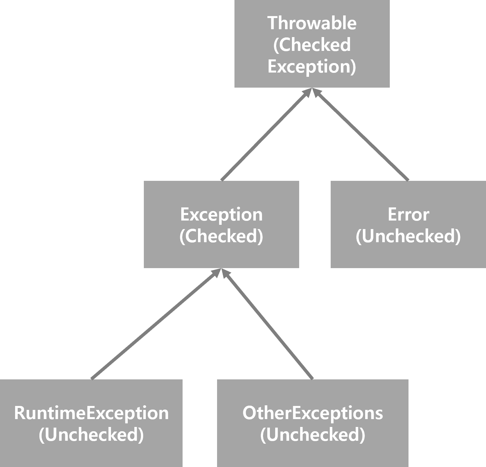

# Item 70. 복구할 수 있는 상황에는 검사 예외를, 프로그래밍 오류에는 런타임 예외를 사용하라

> 개인적으로 자바 문법에서 예외 처리에 대해서 가장 취약한 편이다 ㅠㅠ 기본기가 가끔씩 부족하다고 스스로 가끔 느끼는 편이었는데, 이번 기회에 예외처리에 관해서 확실하게 정리하고 간다는 점에서 다행이라는 생각이 든다. 

 

## 참고한 자료들

- [hbase.tistory.com/115](https://hbase.tistory.com/115)
- [docs.oracle.com - RuntimeException](https://docs.oracle.com/javase/7/docs/api/java/lang/RuntimeException.html)

 

## 핵심정리

복구할 수 있는 상황이면 검사예외(`Checked Exception`)를, 프로그래밍 오류라면 비검사 예외(`Unchecked Exception`) 를 던지자. 확실하지 않다면 비검사 예외(`Unchecked Exception`)를 던지자. 검사 예외(`Checked Exception`)도 아니고 런타임 예외(`RuntimeException` )도 아닌 `Throwable` 은 정의하지도 말자. 검사예외라면 복구에 필요한 정보를 알려주는 메서드도 제공하자. 

 

## 사전 지식 - `Throwable`, `Error`, `Exception`, `Checked`, `Unchecked`

자바는 문제 상황을 알리는 타입으로 Throwable 을 사용한다. 그리고 `Throwable` 클래스는 자바의 모든 `Error` , `Exception` 의 슈퍼클래스다. 

`Exception` 의 하위 클래스로는 `RuntimeException`, `Error` 가 있다.  

그리고 `Checked Exception` , `Unchecked Exception` 이라는 것이 있는데 이것은 예외를 어떻게 처리하면 되는지를 분류하는 용어다. 

`Exception`, `RuntimeException`, `Error` , `Throwable` 클래스간의 클래스 계층도는 아래와 같다.

 

- `Checked Exception`
  - 반드시 코드에서 처리해야 하는 예외다.
  - Checked Exception 은 try ~ cactch 로 예외처리를 하거나 throw 구문으로 상위 메서드에게 예외를 throw 해야 한다.
  - Checked Exception 을 처리하지 않으면 자바 컴파일러가 컴파일 단계에서 컴파일에러를 발생시켜 예외에 대한 처리를 하게끔 유도한다.
  - RutimeException 및 Exception 을 상속받은 기타 클래스들은 대부분 Checked Exception 은 아니다.
  - 쉽게 설명하면, 직접 작성한 메서드에 `throws Exception` 을 명시했다면, 해당 메서드를 호출 하는 caller 측에서는 try~catch, throw 등의 처리를 해줘야 한다. try~catch, throw 등의 처리를 하지 않으면 컴파일 에러가 발생한다.
  - 예외 처리를 컴파일 레벨에서 강제하기 위해 사용되기도 한다.
- `Unchecked Exception`
  - 컴파일 타임에 체크되지 않는 다소 느슨한 예외다.
  - try~catch, throw 로 예외 처리를 별도로 하지 않더라도 컴파일 상에는 문제가 되지 않는다.
  - 예를 들면, `RuntimeException` 을 상속받은 `NullPointerException` , `IndexOutOfBoundException` 등과 같은  클래스가 있다.
  - 즉, 직접 작성한 메서드에 `throws new RuntimeException()` 을 명시했다면, 해당 메서드를 호출 하는 caller 측에서는 try~catch, throw 등의 처리를 꼭 해주지 않아도 컴파일 에러가 발생하지 않는다.

 

## `Checked Throwable/Exception` 이 적합한 경우

**호출하는 쪽(caller 측)에서 복구하리라 여겨지는 상황이라면 검사 예외(Checked Exception)를 사용하라.** 

- Checked Exception 을 사용하면 호출자(caller)가 그 예외를 catch 로 잡아서 처리하거나 더 바깥으로 처리하게 강제된다.
- 이렇게 하면, API 사용자에게 검사예외(Checked Exception)을 던저주어 그 상황에서 적당한 처리를 하게끔 요구하는 효과를 낸다.
- 예외를 잡기만 하고 별다른 조치를 취하지 않게되는 경우도 있을 수 있다. 하지만, 이것은 좋지 않은 습관이다. (아이템 77)

 

## `Unchecked Throwable/Exception`

위에서 살펴봤지만, 비검사 예외 (`Unchecked Throwable` ) 는 `RuntimeException` 과 `Error` 타입이다. 

- 컴파일 레벨에서 예외를 처리하도록 강제하지 않은 경우다.
- 즉, 반드시 예외처리를 구현하지 않아도 되는 경우다.
- 프로그래밍 오류를 나타낼 때는 런타임 예외(RuntimeException) 을 사용하는 것이 좋다.
- 자바의 RuntimeException 의 하위 클래스들은 대표적으로 `IllegalArgumentException`, `BufferOverflowException`, `IndexOutOfBoundsException` 등이 있다.
- 더 자세한 내용은 [docs.oracle.com - RuntimeException](https://docs.oracle.com/javase/7/docs/api/java/lang/RuntimeException.html) 을 참고하자.

 

## Checked vs Unchecked ??

내가 설계하는 메서드/API 가 Checked, Unchecked 둘 중 어떤 예외를 발생시킬지는 복구 가능한지 여부를 따라서 결정하면 된다. 

- 복구가 가능하다면 검사예외(Checked Exception)
- 복구가 불가능하다면 Unchecked Exception 의 한 종류인 RuntimeException 
- 프로그래밍 상의 오류를 나타낼 때 역시 가급적 Unchecked Exception 의 한 종류인 RuntimeException 을 사용하자.

 

`Checked` 예외 (검사 예외) 는 일반적으로 복구할 수 있는 조건일 때 발생한다. `Checked` 예외를 던지는 코드를 작성했다면, 호출자(caller)측의 코드 작성시 예외 상황에서 벗어나는 코드를 작성하기 쉽도록 필요한 정보를 알려주는 메서드를 함께 제공하는 것이 중요하다. 

예를 들면 쇼핑몰에서 물건을 구입하려는데, 카드의 잔고가 부족해 `Checked Exception` 이 발생했다고 해보자. 이런 경우 (예를 들자면...) 예외처리 구문에서 잔고가 얼마나 부족한지를 알려주는 접근자 메서드를 제공해야 한다. 

아이템 75에서도 이와 같은 내용이 나온다. 해당 내용은 아이템 75 를 정리하면서 또 다시 정리할 예정이다. 

 

## `Error`

`Error` 는 보통 JVM 이 자원부족, 불변식 깨짐 등 더 이상 수행을 계속할 수 없는 상황을 나타내기 위해 사용한다. 정해진 것은 아니지만, 업계에 널리 퍼져있는 관행이다.  

이런 이유로 가급적 `Error` 클래스를 상속해서 하위 클래스를 만드는 일은 자제해야 한다. 즉, 왠만하면 직접 구현하게 되는 비검사 `throwable` 은 모두 `RuntimeException` 의 하위 클래스여야 한다. 

`Error` 는 상속하지도 말아야 하고, 가급적 `throw` 구문으로 `Error` 를 던지는 일도 없어야 한다. 

 

## `Exception`, `RuntimeException`, `Error` 외의 `throwable` 타입 예외

`Exception`, `RuntimeException`, `Error` 를 상속하지 않고 `Throwable` 을 바로 상속 바당서 직접 예외 타입을 만드는 경우도 있다. 하지만, **이런 방식은 이로울게 없으니 절대로 사용하지 말아야 한다.** `throwable` 은 정상적인 검사 예외보다 나을 게 하나도 없고, API 사용자를 헷갈리게 할 뿐이다. 

자바 언어 명세에서 이런 `throwable` 은 직접 다루지는 않지만, 암묵적으로 `checked` exception 으로 다뤄진다. 즉, 일반적인 `checked` 예외처리처럼 컴파일 타임에 예외를 처리하는 방식으로 처리된다는 의미다. 

 

**`Throwable` 클래스를 직접 사용하는 경우의 단점** 

`Throwable` 클래스는 대부분 오류 메시지 포맷을 상세히 기술하지 않는다. 이것은 JVM이나 릴리즈에 따라 포맷이 달라질 수 있다는 의미다. 만약 예외에 대한 메서드가 구현되어 있지 않다면, 프로그래머들은 오류 메시지를 파싱해서 예외 정보를 추출해내야 하는데, `Throwable`을 그대로 구현한 예외는 대부분 오류 메시지 포맷이 상세히 기술되어 있지 않기에 JVM 이나 릴리즈에 따라 메시지 포맷이 달라진다. 따라서 이런 예외를 핸들링 하는 코드들이 애플리케이션 내에 있다면  코드가 깨지기 쉽고 다른 환경에서 동작하지 않을 가능성이 높아진다. 

 

