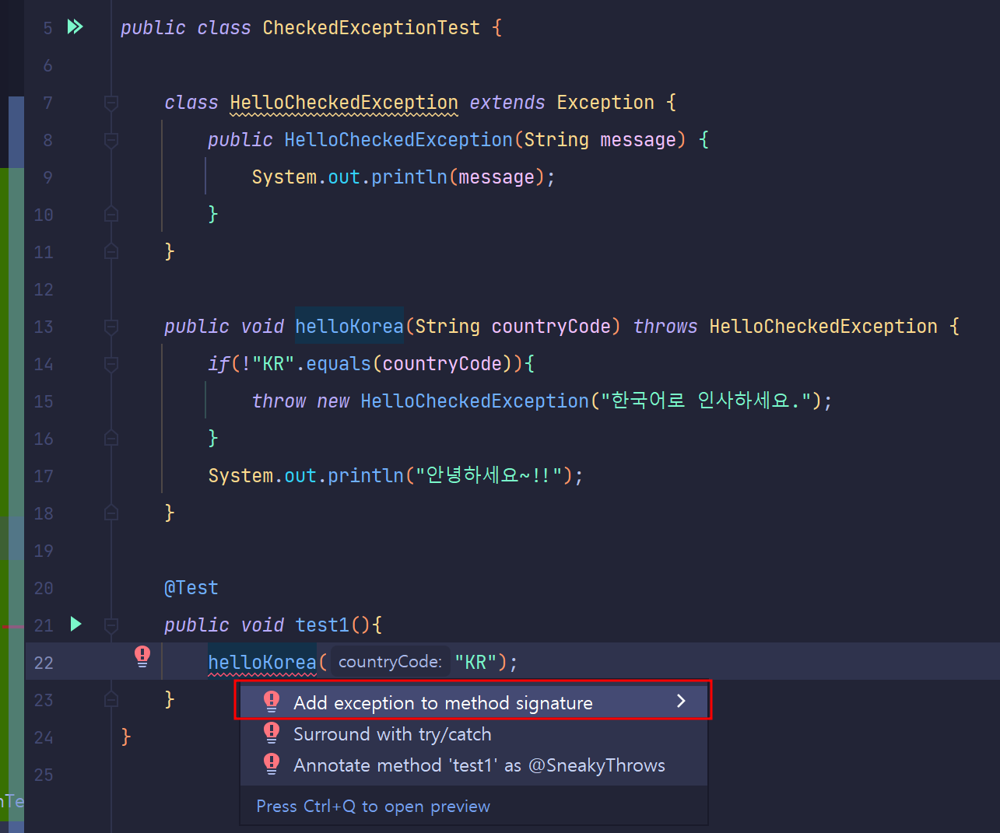
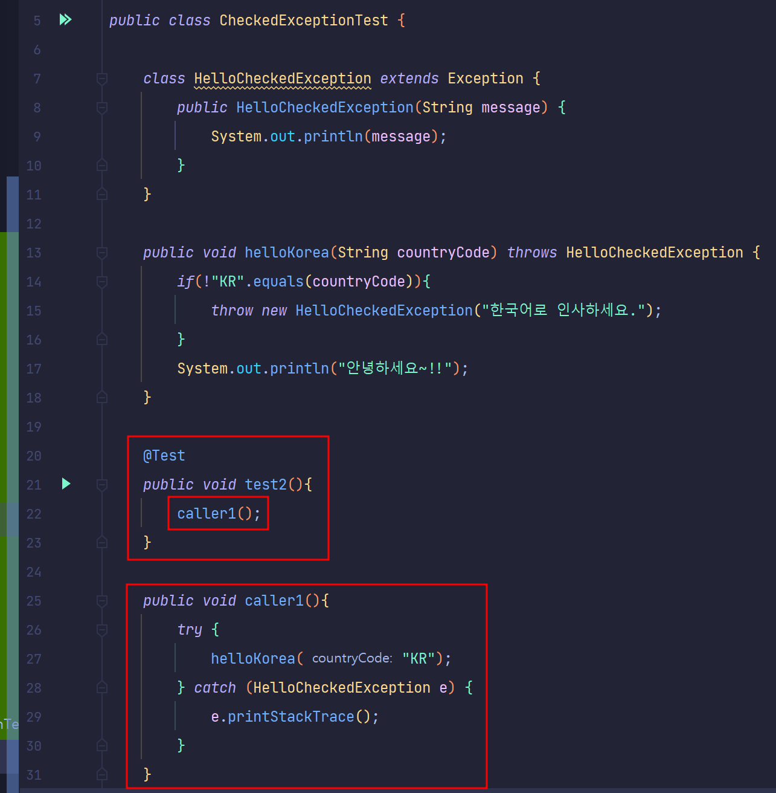
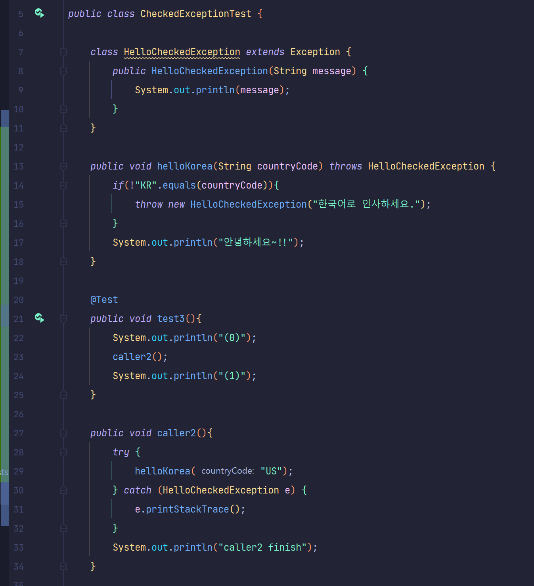
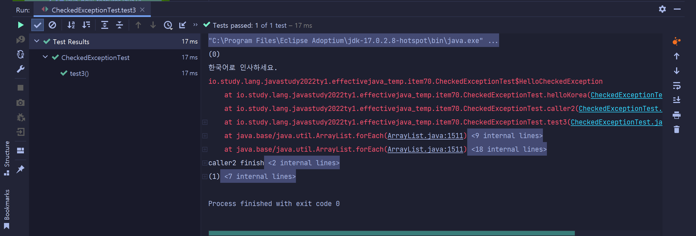
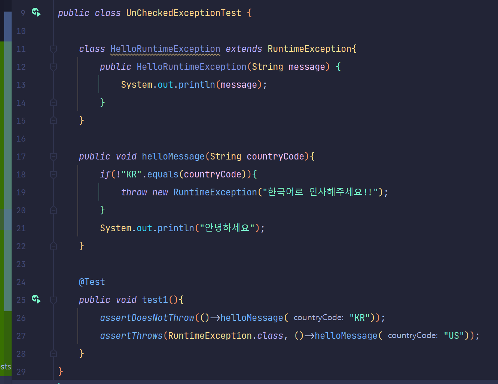
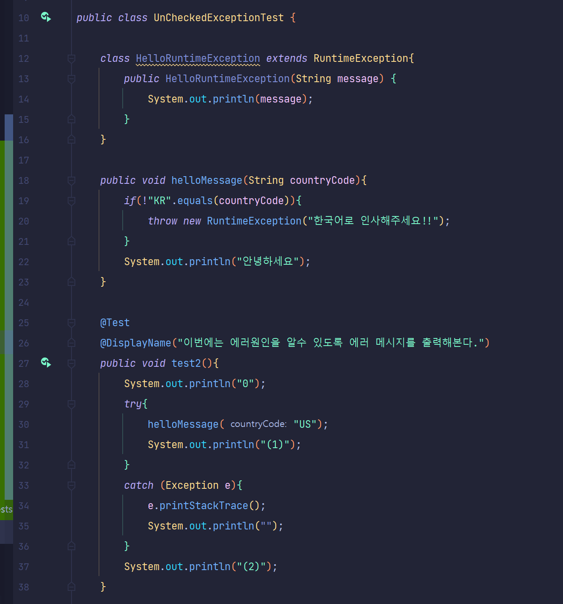
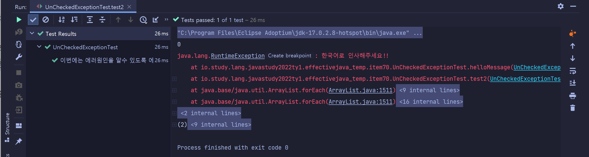
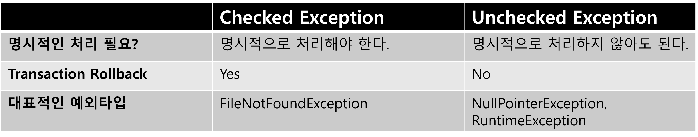

# ITEM 70. 복구할 수 있는 상황에는 검사 예외를, 프로그래밍 오류에는 런타임 예외를 사용하라

<br>

## 참고한 자료들

- [한달한권 - 이펙티브 자바](https://zero-base.co.kr/category_dev_camp/java_1book)
  - 매우 좋은 강의다!! 바쁘다는 핑계로 안듣고 있는 챕터가 꽤 있다. 시간 내서 다 들어야지. 

- [hbase.tistory.com/115](https://hbase.tistory.com/115)
- [docs.oracle.com - RuntimeException](https://docs.oracle.com/javase/7/docs/api/java/lang/RuntimeException.html)

<br>

## 핵심정리

복구할 수 있는 상황이면 검사예외(`Checked Exception`)를, 프로그래밍 오류라면 비검사 예외(`Unchecked Exception`) 를 던지자. 확실하지 않다면 비검사 예외(`Unchecked Exception`)를 던지자. 검사 예외(`Checked Exception`)도 아니고 런타임 예외(`RuntimeException` )도 아닌 `Throwable` 은 정의하지도 말자. 검사예외라면 복구에 필요한 정보를 알려주는 메서드도 제공하자.<br>

<br>

## 사전 지식 - `Throwable`, `Error`, `Exception`, `Checked`, `Unchecked`

자바는 문제 상황을 알리는 타입으로 Throwable 을 사용한다. 그리고 `Throwable` 클래스는 자바의 모든 `Error` , `Exception` 의 슈퍼클래스다.<br>

`Exception` 의 하위 클래스로는 `RuntimeException`, `Error` 가 있다. <br>

그리고 `Checked Exception` , `Unchecked Exception` 이라는 것이 있는데 이것은 예외를 어떻게 처리하면 되는지를 분류하는 용어다.<br>

`Exception`, `RuntimeException`, `Error` , `Throwable` 클래스간의 클래스 계층도는 아래와 같다.


<br>

### Checked Exception

- 반드시 코드에서 처리해야 하는 예외다. 명시적으로 예외처리를 해야 한다.
- Checked Exception 은 `try ~ catch` 로 예외를 처리하거나, `throw` 하지 않으면,  컴파일 에러가 발생한다.
- Checked Exception 은 Transaction이 Rollback 된다.
  - `Checked Exception` 은 해당 `Exception` 이 `throw` 된 것을 `try ~ catch` 로 처리하면 rollback은 이뤄지지 않는다.<br>
  - 말로 설명하니 이상하다. 코드는 역시 코드로 배우는게 맞기는 할때가 있는가보다. 문서 최 하단 부에 Transaction 예제도 정리해놓을 예정이다.
- ex) `FileNotFoundException` 
- 예외 처리를 컴파일 레벨에서 강제하기 위해 사용되기도 한다.
- RutimeException 및 Exception 을 상속받은 기타 클래스들은 대부분 Checked Exception 은 아니다.

코드를 말로 설명하는 것은 역시 재미가 없고, 외계어 같다. 코드로 예를 들어 정리해봐야 겠다.<br>

<br>

**예제 1) Checked Exception 을 던지는 메서드를 그냥 사용하는 경우** <br>

예를 들어 아래와 같은 코드가 있다고 해보자. `Checked Exception` 타입인 `Exception` 을 상속받아 확장한 클래스 `HelloCheckedException` 이 있다. <br>

그리고 `helloKorea(String countryCode)` 라는 메서드에서는 인자 값 `String countryCode` 가 "KR" 이 아닐 경우 `HelloCheckedException` 이라는 예외를 던지고 있다.<br>



위 코드에서 `test1`  이라는 메서드에서는 `helloKorea("KR")` 로 메서드를 호출하고 있다. 그런데, 예외가 발생하지 않을 수도 있는 경우에서 예외를 추가하도록 컴파일 레벨에서 미리 강제하고 있다.<br>

<br>

**예제 2) `Checked Exception` 이 발생하는 메서드를 한단계 감싸고, 해당 메서드에서 try/catch 처리를 해서 호출해보기**<br>

예외를 던지는 메서드인 `helloKorea(String countryCode)` 메서드를 `caller1()` 라는 메서드에서 호출하도록 구조를 바꿨다. 그리고 `caller1()` 메서드는 메서드 `test2()` 에서 try/catch 블록 없이 그냥 호출해도 **"컴파일 에러"**가 발생하지 않는다.<br>



<br>

**예제3) try/catch 처리를 한 경우 다음 라인을 수행하는지 확인**<br>

이번에는 Checked Exception 을 내는 예외를 감싼 메서드`caller2()` 에서 예외가 발생했을 때 그 다음 라인을 수행하는지 확인해보자. Checked Exception 을 발생시켜도, 해당 예외 라인을 try/catch 처리를 하면 다음라인으로 계속 진행할 수 있다.



<br>

출력결과<br>

출력결과는 아래와 같다. 예외가 발생한 곳의 예외 메시지와 catch 구문에 해둔 예외 처리시 동작을 수행하고 그다음 라인 처리를 수행을 이어서 수행한다.



<br>

### UnChecked Exception

- 명시적인 예외처리가 강제되는 `Exception` 은 아니다.
- 컴파일 타임에 체크되지 않는 다소 느슨한 예외다.
- try/catch, throw 등으로 예외 처리를 별도로 하지 않더라도 컴파일 상에는 문제가 되지 않는다.
- 런타임시에 에러 스택트레이스 출력 및 별도의 프로그래밍 처리로 에러가 발생했음을 감지할 수 있다.

- ex) `RuntimeException`, `NullPointerException`<br>

역시 한국말로 어떻게 설명해보려 했지만, 조금 더 설명을 추가할 수록 이상한 말이 되어버려서 예제로 정리하기로 했다.<br>

<br>

**예제 1) RuntimeException 을 throw 하는 메서드를 try/catch 없이 그냥 호출해보는 예제**<br>

코드는 아래와 같이 작성했다. 메서드 `test1()` 에서 메서드 `helloMessage("US")` 를 별도의 try/catch 에서 호출하지 않았음에도 컴파일에러가 발생하지 않았다. 출력결과 역시 정상이다. 



<br>

출력결과

```plain
안녕하세요
```

<br>

**예제 2) RuntimeException 을 내는 메서드를 try/catch 블록으로 감싸 처리하는 예**<br>

try/catch 로 예외가 발생하는 라인을 감싸고 그 다음 라인을 수행하는지 명시적으로 확인하기 위해 `System.out.println` 이용해 0, 1, 2 를 찍어봤다. 출력구문을 보고 동작을 확인하자.



<br>

출력결과



출력결과를 자세히 보면 `e.printStackTrace()` 로 출력한 에러를 출력해주고, try/catch 블록의 그 다음 라인을 순차적으로 실행하고 있는 것을 확인할 수 있다.(`(2)` 가 콘솔에 출력됐다.)<br>

즉, 에러가 난 곳에서 탈출하지 않고, 에러를 출력하거나 catch 구문에 지정한 메서드를 수행하도록 하고, try/catch 다음 라인을 계속해서 순차적으로 실행한다.<br>

<br>

### Checked Exception, UnChecked Exception 정리

**Checked Exception**<br>

- Checked Exception 은 컴파일 타임에 try/catch 블록으로 처리를 명시적으로 하지 않으면 컴파일 에러를 낸다. (또는 throw 로 예외를 전파하지 않아도 컴파일 에러를 낸다.) 대표적으로 `FileNotFoundException` 이 있다.
- Checked Exception 이 발생하면 Transaction 은 rollback 된다.
  - 단, throw 된 Checked Exception 을 별도의 try/catch 로 처리를 하면, rollback 은 이뤄지지 않는다.
- ex) `FileNotFoundException` 

<br>

**Unchecked Exception**<br>

- Unchecked Exception 은 컴파일 타임에 try/catch 블록으로 처리를 명시적으로 하지 않아도 컴파일 에러는 발생하지 않는다. 대표적으로 `NullPointerException`, `RuntimeException` 이 있다.
-  Unchecked Exception 이 발생하더라도 Transaction 은 rollback 되지 않는다.
- ex) `NullPointerException`, `RuntimeException`

<br>

참고한 자료 : [한달한권 - 이펙티브 자바](https://zero-base.co.kr/category_dev_camp/java_1book)<br>

인터넷에 정확하게 설명하는 곳이 어디인지 확신이 들지 않아서, [한달한권 - 이펙티브 자바](https://zero-base.co.kr/category_dev_camp/java_1book) 의 내용을 듣고 정리. 



조금 더 내용을 찾아보면서 공식자료를 구해서 정리할까 했는데, 강의 내용이 너무 깔끔하고 직관적이라 더 정리할 필요를 못느꼈다. <br>

그래도 나머지 공부 좀 해야할 듯 싶기는 하다.<br>

<br>

## `Checked Throwable/Exception` 이 적합한 경우

**호출하는 쪽(caller 측)에서 복구하리라 여겨지는 상황이라면 검사 예외(Checked Exception)를 사용하라.**<br>

- Checked Exception 을 사용하면 호출자(caller)가 그 예외를 catch 로 잡아서 처리하거나 더 바깥으로 처리하게 강제된다.
- 이렇게 하면, API 사용자에게 검사예외(Checked Exception)을 던저주어 그 상황에서 적당한 처리를 하게끔 요구하는 효과를 낸다.
- 예외를 잡기만 하고 별다른 조치를 취하지 않게되는 경우도 있을 수 있다. 하지만, 이것은 좋지 않은 습관이다. (아이템 77)
- 개인적인 의견
  - 책의 설명이 코드로 봐야할 것들을 말로 길게 설명하고 있기에 이해가 다소 쉽지 않다. 그래서 개인적인 의견을 적어봤다.
  - 개인적으로는, `CheckedException` 은 비지니스 로직을 개발하는 개발자라면, 복구가 가능한 경우에 한해서 사용하는 것이 올바른 사용법인 것 같다는 생각이 들었다.
  -  예를 들면, 부서 A에서는 새로운 예외를 정의 후, 네트워크 에러로 인한 결제 실패시, 네트워크 에러로 인한 결제 실패에 대한 커스텀 Checked Exception 을 throw 하기로 했지만, 다른 부서B 에서는 미리 네트워크 에러로 인한 예외가 추가되었다는 공지를 전달받지 않았다고 해보자.<br>
    예외 타입이 추가된 것 역시 가이드 문서로 추가되어 있지 않은 상태다. 이렇게 되면 해당 다른 부서에서는 소스를 update 받자 마자 Checked Exception 을 처리하던 코드가 갑자기 계속해서 컴파일 에러가 발생하게 될 수 있다. <br>


<br>

## `Unchecked Throwable/Exception`

위에서 살펴봤지만, 비검사 예외 (`Unchecked Throwable` ) 는 `RuntimeException` 과 `Error` 타입이다.<br>

- 컴파일 레벨에서 예외를 처리하도록 강제하지 않은 경우다.
- 즉, 반드시 예외처리를 구현하지 않아도 되는 경우다.
- 프로그래밍 오류를 나타낼 때는 런타임 예외(RuntimeException) 을 사용하는 것이 좋다.
- 자바의 RuntimeException 의 하위 클래스들은 대표적으로 `IllegalArgumentException`, `BufferOverflowException`, `IndexOutOfBoundsException` 등이 있다.
- 더 자세한 내용은 [docs.oracle.com - RuntimeException](https://docs.oracle.com/javase/7/docs/api/java/lang/RuntimeException.html) 을 참고하자.

<br>

## Checked vs Unchecked 둘중 뭘 쓸지 고민이라면?

> TODO: 책의 내용을 그대로 정리했는데, 책의 내용이 다소 너무 길어서 조금 더 요약해서 예를 든 설명으로 따로 정리할 예정이다.<br>

<br>

내가 설계하는 메서드/API 가 Checked, Unchecked 둘 중 어떤 예외를 발생시킬지는 복구 가능한지 여부를 따라서 결정하면 된다.<br>

- 복구가 가능하다면 검사예외(Checked Exception)
- 복구가 불가능하다면 Unchecked Exception 의 한 종류인 RuntimeException 
- 프로그래밍 상의 오류를 나타낼 때 역시 가급적 Unchecked Exception 의 한 종류인 RuntimeException 을 사용하자.

<br>

`Checked` 예외 (검사 예외) 는 일반적으로 복구할 수 있는 조건일 때 발생한다. `Checked` 예외를 던지는 코드를 작성했다면, 호출자(caller)측의 코드 작성시 예외 상황에서 벗어나는 코드를 작성하기 쉽도록 필요한 정보를 알려주는 메서드를 함께 제공하는 것이 중요하다.<br>

예를 들면 쇼핑몰에서 물건을 구입하려는데, 카드의 잔고가 부족해 `Checked Exception` 이 발생했다고 해보자. 이런 경우 (예를 들자면...) 예외처리 구문에서 잔고가 얼마나 부족한지를 알려주는 접근자 메서드를 제공해야 한다.<br>

아이템 75에서도 이와 같은 내용이 나온다. 해당 내용은 아이템 75 를 정리하면서 또 다시 정리할 예정이다.<br>

<br>

## `Error`

`Error` 는 보통 JVM 이 자원부족, 불변식 깨짐 등 더 이상 수행을 계속할 수 없는 상황을 나타내기 위해 사용한다. 정해진 것은 아니지만, 업계에 널리 퍼져있는 관행이다. <br>

이런 이유로 가급적 `Error` 클래스를 상속해서 하위 클래스를 만드는 일은 자제해야 한다. 즉, 왠만하면 직접 구현하게 되는 비검사 `throwable` 은 모두 `RuntimeException` 의 하위 클래스여야 한다.<br>

`Error` 는 상속하지도 말아야 하고, 가급적 `throw` 구문으로 `Error` 를 던지는 일도 없어야 한다.<br>

<br>

## `Exception`, `RuntimeException`, `Error` 외의 `throwable` 타입 예외

`Exception`, `RuntimeException`, `Error` 를 상속하지 않고 `Throwable` 을 바로 상속 바당서 직접 예외 타입을 만드는 경우도 있다. 하지만, **이런 방식은 이로울게 없으니 절대로 사용하지 말아야 한다.** `throwable` 은 정상적인 검사 예외보다 나을 게 하나도 없고, API 사용자를 헷갈리게 할 뿐이다.<br>

자바 언어 명세에서 이런 `throwable` 은 직접 다루지는 않지만, 암묵적으로 `checked` exception 으로 다뤄진다. 즉, 일반적인 `checked` 예외처리처럼 컴파일 타임에 예외를 처리하는 방식으로 처리된다는 의미다.<br>

<br>

**`Throwable` 클래스를 직접 사용하는 경우의 단점**<br>

`Throwable` 클래스는 대부분 오류 메시지 포맷을 상세히 기술하지 않는다. 이것은 JVM이나 릴리즈에 따라 포맷이 달라질 수 있다는 의미다. 만약 예외에 대한 메서드가 구현되어 있지 않다면, 프로그래머들은 오류 메시지를 파싱해서 예외 정보를 추출해내야 하는데, `Throwable`을 그대로 구현한 예외는 대부분 오류 메시지 포맷이 상세히 기술되어 있지 않기에 JVM 이나 릴리즈에 따라 메시지 포맷이 달라진다. 따라서 이런 예외를 핸들링 하는 코드들이 애플리케이션 내에 있다면  코드가 깨지기 쉽고 다른 환경에서 동작하지 않을 가능성이 높아진다.<br>

<br>

## 테스트코드 1)  Transaction 내에서의 Checked Exception

요즘 인간적으로 시간이 너무 부족해서 이것 까지 바로 정리는 못할 것 같다. 물리적으로 시간자체가 부족해서 뭘 할래야 할수가 없는 상황이다... 예제를 이번 주 중으로 추가하겠지만, 이번주 내에 추가하지 못하면 차차주 내에라도 정리할 예정!!! <br>

요즘 일이 좀 많이 힘들기도 하고 버겁다. 그래서 개인 공부에 신경을 제대로 쓰지 못하고 있다. 최근에는 뭘 만들라 그러는데 이해 당사자들은 아직 뭘 만들지도 모르는 상태다. 기획도 안나와 있다. 무엇을, 언제까지, 어떻게, 어디까지 만들지에 대한 결정없이 4월 2주차 까지 뭘 만들라고 그런다. 그런데 그게 어떤건지 나도 모르고, 이해당사자는 하나도 모르는 상태다. 이대로 상용가도 되나 싶은 생각이 드는데 1주일 내로 만들자 그런다. 도저히 뭘 하자는건지 모르겠어서 짜증나고 분하더라...<br>

너무 황당해서... 그래서 만들려는게 뭔지 하나 하나 질문하니, 본인들도 모른다. 정책서도 안나왔다. 본인들도 뭘 만드는지 모른는데 날 왜 시키는 거지? 하고 생각이 자꾸 든다. 거기다 난 주식이 뭔지 모르는 사람이다.... 정해진 시간 안에 이번 버전은 어디까지 만들어져 있어야 한다는 간단한 문서 자체도 없다. 그냥 아무때나 원하는 대로 멋대로 상용에 배포하고 서버 끄고 수정하자는 식이다. 그럼 또 난 매번 밤새야 한다. 본인들은 어쩌다 한번 밤새지만, 나는 쉬는 때가 없다.<br>

누군가의 또 진취적인 감정적인 판단으로 단순하게 명령하달 시켜서 이렇게 되는 건가 싶기도 하다는 생각은 들어서 참고 있기는 한데, 진짜 이건 좀 횡포가 아닌가 싶을 정도로 업무 폭력이지 않나 싶다. 아무리 뭘 좀 몰라도 좀 물어보고 명령하달을 내리던가... <br>

스트레스가 극에 달해서 100원짜리 크기의 혓바늘이 나서 터져서 피가 났던게 덧나서 주말동안 거의 아무것도 먹지 못했다... 아무리 화가 나도 30프로는 사회적인간인지라 속은 썩어도, 겉으로는 웃으면서 이야기 하긴 하는데, 이게 속병이 나나 보다 싶다.<br>

이런 상황이 입사 초기부터 자주 있어왔다. 입사 초반에 만들어진 레거시 코드도 벤더사 가격 정책 변경으로 ID 체계가 바뀌는데, 온프레미스로 데이터를 확인해보는 것 없이 상용으로 직행해서 개발하자고 우겨서 어마 어마하게 고생하면서 만들었었다. 그렇게 멋대로 생각나는 대로 할꺼면 지들이 하던가, 그렇게 말도 안되는 오더를 왜 억지로 나한테 하라고 하는지... 무슨 자신감들인지 모르겠다. 울고 싶을 정도였다. 적어도 베타에서 테스트하고 나서 가자고 하지 왜 나한테 이러나 싶었다. 그 당시를 떠올리면 거의 모든 데이터 필드를 일일이 수작업으로 상용 서버에 로그로 남겨서 일일이 노가다로 확인해봐야 하는 정도로 암울했었고, 거기다가 외국 벤더사에 영어로 일일이 직접 문의해서 확인해야 하는 개발환경 문제도 있어서 직접 해당 외국 기업에 문의하고 난리도 아니였다. 매일 매일이 밤샘근무였다..<br>

개발 중간에 데이터를 페이스 분리하는 것도 충분히 생각해냈었는데, 이야기 꺼내면, 본인들이 똑똑하다고 생각해서 안되는거라 우겨서 아직 까지도 상용에서 `고~~대로` 작업중이긴 한데, 도대체 본인들께서 언제까지 얼마나 똑똑하신지도 좀 봐야 할듯 싶다. 난 이미 몸도 마음도 지쳐서 더 못버틸것 같은데 1주일씩 연장해서 겨우 겨우 일하는 중이다... 1주일 버티는 것도 요즘은 힘에 매우 많이 부친다. 뭐 이런 인간들이 있나 싶다...<br>

<br>

## 테스트 코드 2) Transaction 내에서의 Unchecked Exception 

이것 역시 위의 이유로 인해 나중에 정리 예정이다.<br>

<br>

