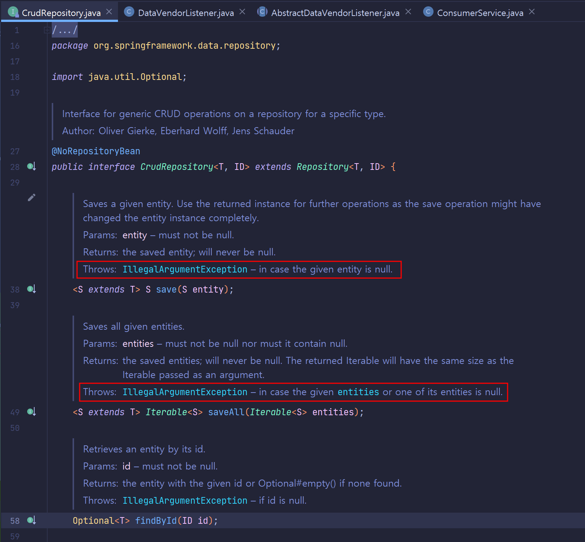
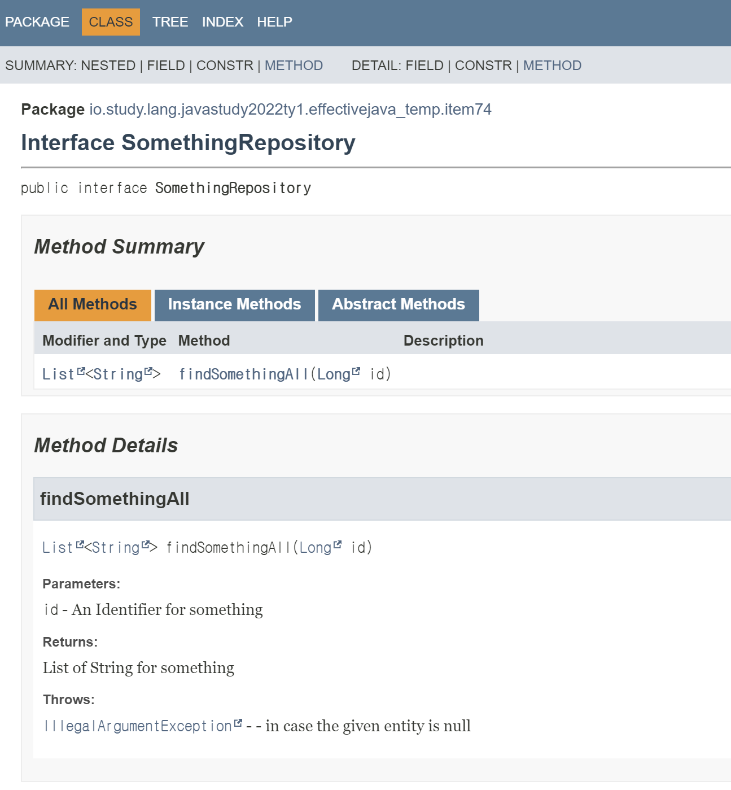

# ITEM 74. 메서드가 던지는 모든 예외를 문서화하라

가급적 예외를 던지도록 선언한다면, Checked Exception 은 항상 따로 따로 선언하고, Java Doc 의 `@throwas` 태그를 사용해서 문서화하는 것이 좋다.<br>

<br>

## 핵심정리

> 책에서 정리하는 내용. 그냥 발췌 및 요약

메서드가 던질 가능성이 있는 모든 예외를 문서화하라. 검사예외든 비검사 예외든 추상메서드든 구체 메서드든 모두 마찬가지다. 문서화에는 자바독의 `@throws` 태그를 사용하면 된다. 검사예외만 메서드 선언의 `throws` 문에 일일이 선언하고, 비검사 예외는 메서드 선언에는 기입하지 말자. 발생가능한 예외를 문서로 남기지 않으면 다른 사람이 그 클래스나 인터페이스를 효과적으로 사용하기 어렵거나 심지어 불가능할 수 도 있다.<br>

<br>

## 메서드 선언시에는 가급적 상위타입 예외로 얼버무리지 말자.

 그 예외에 대해서 `Exception` , `Throwable` 을 던진다고 대충 얼버무리듯이 상위타입으로 얼버무려 선언하는 일을 삼가하기를 책에서 언급하고 있다.<br>

이렇게 하면, 메서드 사용자에게 각 예외에 대처할 수 있는 힌트를 주지 못하고, 같은 맥락에서 발생할 여지가 있는 다른 예외들도 삼켜버릴 수 있어서 API 사용성을 크게 떨어뜨리게 된다.<br>

단, main 문의 경우는 예외다. main 은 오직 JVM 만이 호출하기에 Exception 을 던지도록 선언해도 된다.<br>

<br>

## Unchecked Exception 도 Checked Exception 만큼 문서화하는 것은 좋은 방식이다.

Unchecked Exception 은 일반적으로 프로그래밍 오류를 의미한다. 따라서 자신이 일으킬수 있는 예외가 무엇인지 알려주게 된다면, 관련 로직에 연관된 담당자들이 자연스럽게 오류가 나지 않도록 코딩할 수 있게 된다.<br>

Unchecked Exception 이 발생할 수 있다고 문서를 잘 정리두면, 메서드가 잘 수행되게끔 하는 하나의 조건을 만들어둘 수 있다.<br>

발생 가능한 비검사 예외를 문서로 남기는 것은 강제 상황은 아니지만, 인터페이스 메서드에서 특히 중요하다.<br>

<br>

## 인터페이스의 메서드에 대한 Unchecked Exception 에 대한 규약을 남기는 것 

예를 들면, JPA 의  대표적인 interface 인 CrudRepository 를 예로 들어보면 아래와 같이 Unchecked Exception 들에 대해서 어떤 경우에 예외를 던지는지 명확하게 언급하고 있다.<br>



<br>

이렇게 해두면, CrudRepository 를 implement 하는 구현체들에도 일관된 규약을 적용할 수 있게 된다.<br>

<br>

## 자바독의 `@throws`

자바가 제공하는 유틸리티 내에는 javadoc 역시 존재한다. javadoc 유틸리티를 활용하면 메서드 선언의 @throws 태그에 대해 별도로 표시를 해준다. 역시 글로만 설명하면 조금 이상하다.<br>

(참고한 자료 : [javadoc @throws, @exception 태그](https://araikuma.tistory.com/663) )<br>

자바독의 기능에 대해서는 다른 챕터에서 설명할 예정이지만, 간단하게나마 예제를 정리해두고 넘어가보면 이렇다.

아래와 같은 인터페이스를 작성했다고 해보자.

```java
import java.util.List;

public interface SomethingRepository {

    /**
     * @param id  An Identifier for something
     * @return  List of String for something
     * @throws IllegalArgumentException - in case the given entity is null
     */
    public List<String> findSomethingAll(Long id);
}
```

이렇게 작성한 메서드는 javadoc 유틸리티를 이용해 생성한 javadoc html 파일은 아래와 같이 나타난다.



<br>

## Unchecked Exception 문서화, 꼭 모두 해야 하는 것은 아니다.

클래스를 수정하면서 새로운 Unchecked Exception 을 던지게 되어도 Javadoc 로 생성하는 문서에는 태그를 걸어놓거나, 기록을 해두지 않는한 해당 내용이 반영되지는 않는다.<br>

이 외에도 같은 클래스에서 모든 메서드가 동일하게 같은 예외를 던지는 경우가 있다. 이런 경우는 각 메서드마다 모두 예외를 던진다고 굳이 일일이 명시해두지 않아도 된다. 클래스 설명에 해당 예외를 언급하면 된다.<br>

<br>

언어에서 이야기하는 모든 규칙이나, 대가들이 이야기하는 코딩컨벤션등을 모두 지킬수 없다. 실제로는 이렇게 모두 지켜서 일이 바로 진행되지 않는 경우가 정말 많다. 제일 중요한 것은, 실무에서 같은 팀이 정한 규칙을 따루는 것이 현업을 따르는 중요한 원칙이지 않을까 싶다.<br>

<br>


