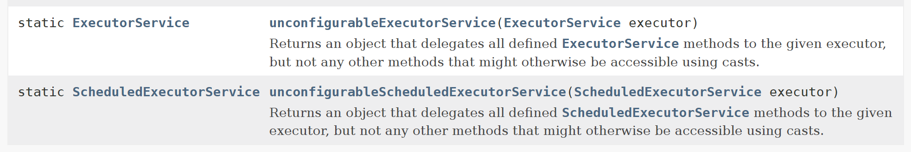
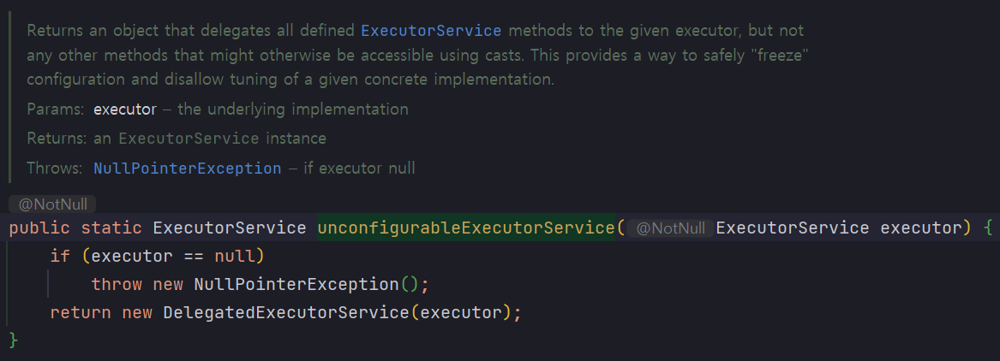

# 8.3.5 ThreadPoolExecutor 생성 이후 설정 변경

ThreadPoolExecutor 객체를 생성자 또는 팩토리 메서드로 생성한 후에 `ThreadPoolExecutor` 의 세부 옵션들은 `ThreadPoolExecutor` 클래스의 setter 를 이용해 수정할 수 있다. <br>

`Executors` 의 `newFixedThreadPool`, `newCachedThreadPool`, `newSingleThreadPool` 을 사용해 `ExecutorService` 객체를 생성한 경우는 `ThreadPoolExecutor` 타입으로 형변환 후에 setter 를 사용할 수 있다.<br>

<br>  

## ExecutorService 의 다양한 setter 들

`Executors` 클래스에서 제공하는 여러가지 팩토리 메서드 들 중 하나의 팩토리 메서드로 `Executor` 객체를 생성할 경우 생성된 객체를 `ThreadPoolExecutor` 타입으로 형변환 해서 여러가지 setter 를 필요에 따라 호출해 세부 옵션을 바꿔가면서 수정할 수 있다.<br>

setter 로 주로 수정하는 값들은 corePoolSize, maximumPoolSize, keepAliveTime (스레드 유지 시간) 등의 값들이나 스레드 팩토리, 작업 거부 처리 정책 등을 직접 지정가능하다.<br>

아래 예제는 Executors 에서 제공하는 팩토리 메서드들을 사용할 경우 어떤 방식으로 `ExecutorService` 계층의 settter 를 활용해 수정하는지에 대한 예제다. 예를 들면 `newCachedThreadPoolExecutor`, `newFixedThreadPoolExecutor` , `newSingleThreadPoolExecutor` 등의 팩토리 메서드 들에 활용 가능하다.<br>

```java
ExecutorService exec = Executoers.newCachedThreadPool();
if(exec instanceof ThreadPoolexecutor){
    ((ThreadPoolExecutor) exec).setCorePoolSize(10);
}
else{
    throw new AssertionError("Oops, bad assumption")
}
```


<br>

## `unconfigurableExecutorService`

`Executors` 에는 `unconfigurableExecutorService` 메서드가 있다. 아래 캡처를 보면 비슷하게 ScheduledExecutorService 에도 비슷한 역할을 하는 `unconfigurableScheduledExecutorService` 가 존재하는 것을 확인 할 수 있다.<br>



출처 : [docs.oracle.com](https://docs.oracle.com/javase/8/docs/api/java/util/concurrent/Executors.html)<br>

<br>

`unconfigurableExecutorService` 메서드는 현재 만들어져 있는 `ExecutorService` 를 넘겨받아서, `ExecutorService` 내의 메서드들만을 외부에 노출하고 나머지는 모두 가리도록 해주는 역할을 한다. 직접 구현한 `Executor`의 실행 정책이 변경되지 않도록 하기 위해 사용한다. 또는 직접 구현한 Executor 클래스의 설정을 외부 코드에서 setter 등을 통해 변경하지 못하도록 할 경우에도 `unconfigurableExecutorService` 메서드를 사용하면 된다.

unconfigurableExecutorService 메서드의 내부 구현은 아래와 같다.<br>



<br>


